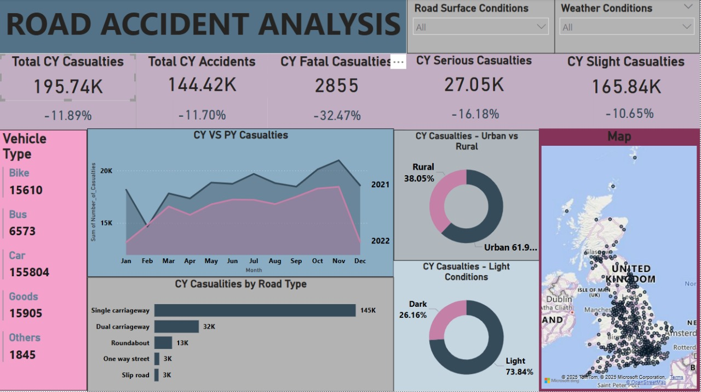

# 🚗 Power BI Road Accident Dashboard

This repository contains an interactive Power BI dashboard designed to analyze road accident data. The dashboard visualizes key metrics like total casualties, accident trends, severity types, and geographic distribution of accidents across the United Kingdom.

---

## 📌 Objective

To gain insights into road accident trends, identify high-risk conditions, and visualize accident metrics using dynamic charts, slicers, and maps. The aim is to support awareness and decision-making toward improving road safety.

---

## 📊 Dashboard Features

- **KPIs** for:
  - Total Casualties
  - Fatalities, Serious, and Slight Casualties
  - Total Accidents (CY vs PY trends)
- **Filters** for:
  - Road Surface Conditions
  - Weather Conditions
- **Visuals include**:
  - Time series comparison (Current Year vs Previous Year)
  - Urban vs Rural accident share
  - Casualties by vehicle type and road type
  - Light conditions during accidents
  - Interactive map showing accident density in the UK

---

## 📁 Repository Contents

- `Road_Accident_Dashboard.pbix` – Power BI report file
- `README.md` – Project documentation
- `images/dashboard_screenshot.jpg` – Dashboard visual preview
- `dataset/road_accident_data.csv` – Cleaned or raw dataset used for building the dashboard *(add this file if allowed)*

---

## 📄 Dataset

- **Source**: [UK Department for Transport - Road Safety Data](https://data.gov.uk/dataset/road-accidents-safety-data)
- **Description**:
  - Includes accident date, time, vehicle type, casualty class and severity, location coordinates, road type, weather and lighting conditions, and more.
- **License**: Open Government License (OGL) – freely reusable with attribution.

---

## 🛠 Tools Used

- **Power BI** – Visualization and modeling
- **Power Query** – Data cleaning and shaping
- **DAX** – Custom KPIs and calculated metrics

---

## 🖼 Dashboard Preview

---

## 📚 Learnings

- Hands-on experience with dashboard design
- Slicer and filter integration
- Geospatial mapping in Power BI
- Comparative time-series visualization

---

## 📌 License

This project is open-source and intended for educational and portfolio purposes. Dataset is credited to the UK Department for Transport.

